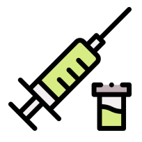

# Vaccine Monitoring Platform - Android application
> Tablet application for use by operators in the field to identify or register vaccination campaign participants,
check eligibility for dosages and log visits.

- Built upon the openMRS backend system
- Iris scan
- Barcode reader

[Getting Started](#vaccine-tracker)

