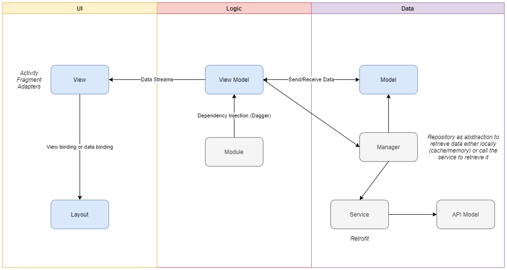

# Architecture

## MVVM Architecture

The application architecture follows the Model-View-ViewModel (MVVM) architecture model.



* **Model:** plain objects representing the data elements
* **View:** UI (Activity/Fragment and XML). It sends UI events (such as button presses) to the ViewModel and may subscribe for results. It should not contain any business logic.
* **ViewModel:** connects the view to the model and contains the business logic and all backend calls. It is not aware of which view is using it.

Furthermore, we make use of the following:

* **Databinding:** Facilitates the connection between View and ViewModel, by  allowing observable fields in the ViewModel to be referenced within layout XML.
* **Dependency Injection:** Using the [Dagger2 library](https://github.com/google/dagger) we inject reusable modules into the application while avoiding writing boilerplate factory classes.

## Directory Structure

The Android application uses a Feature/Component directory structure, to make the sourcecode easy to navigate.

``` text
app/src/main/java/com/jnj/vaccinetracker
├── common/
│   ├── data/
│       ├── managers/
│       ├── models/
│       ├── network/
│       ├── repositories/
│   ├── di/
│   ├── helpers/
│   ├── ui/
│       ├── databinding/
│   ├── viewmodel/
├── barcode/
├── irisscanner/
├── login/
├── participantflow/
│   ├── dialogs/
│   ├── model/
│   ├── screens/
├── register/
│   ├── dialogs/
│   ├── screens/
├── settings/
├── siteselection/
├── splash/
├── visit/
│   ├── dialog/
│   ├── screens/
├── VaccineTrackerApplication.kt
```

| Directory     | Contents / Description                              |
|:--------------|:----------------------------------------------------|
| managers      | Classes with methods that return backend responses  |
| models        | Data classes, enums and constants  |
| network       | Contains the Service class that defines the API calls and any interceptors  |
| repositories  | Classes with methods that local db results. The only locally stored data in this app is the user session.  |
| di            | Reusable modules and classes needed for Dependency Injection  |
| helpers       | Extensions and objects containing helper methods  |
| ui            | Base classes for activities, fragments and dialogs. Objects for databinding in adapters.  |
| viewmodel     | Base class for viewmodels  |

## External Libraries

| Library                                                                   | Purpose                               | License                        |
|:--------------------------------------------------------------------------|:--------------------------------------|--------------------------------|
| [countryCodePicker](https://github.com/hbb20/CountryCodePickerProject)    | Phone number country codes interface  | Apache-2.0                     |
| [dagger](https://github.com/google/dagger)                                | Dependency Injection                  | Apache-2.0                     |
| [glide](https://github.com/bumptech/glide)                                | Image loading and caching             | BSD, part MIT and Apache 2.0   |
| [okhttp](https://github.com/square/okhttp)                                | HTTP Client                           | Apache-2.0                     |
| [libphonenumber](https://github.com/google/libphonenumber)                | Phone number parsing and validation   | Apache-2.0                     |
| [moshi](https://github.com/square/moshi)                                  | JSON parsing                          | Apache-2.0                     |
| [neurotec](https://www.neurotechnology.com/verieye.html)                  | Neurotechnology SDK for iris scan     | License activation required    |
| [niddler](https://github.com/icapps/niddler)                              | Network debugging tool (dev only)     | Apache-2.0                     |
| [retrofit](https://github.com/square/retrofit)                            | HTTP Client                           | Apache-2.0                     |
| [rxjava](https://github.com/ReactiveX/RxJava)                             | Observable sequences                  | Apache-2.0                     |
| [zxing](https://github.com/zxing/zxing)                                   | Barcode scanning library              | Apache-2.0                     |
