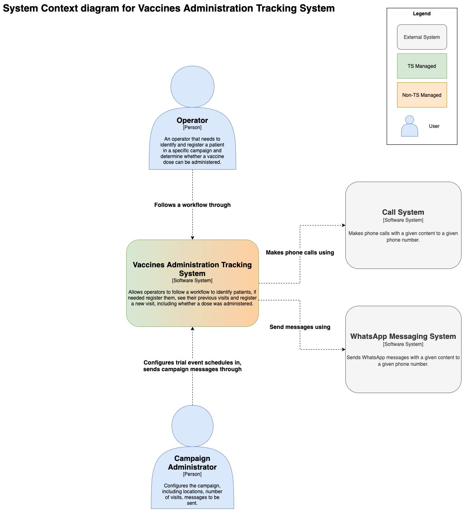
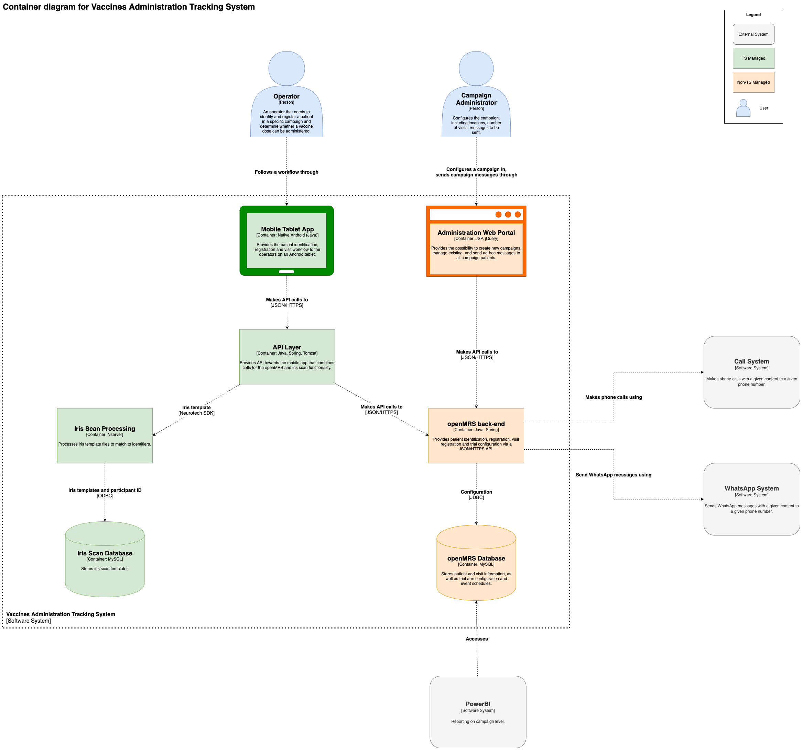

# Overall Architecture

## Introduction & Context

This system is to function as an independent platform for the identification of patients and the logging of vaccine administrations and follow-ups.

The main components of the system are:

* Tablet Application for Operator
* Back-end system for management of trial arms and event schedules, based on openMRS
* Intermediate API layer
* Iris scan system, based on Neurotechnology VeriEye

## Architectural Goals & Constraints

* Built upon the openMRS platform as the visit management back-end
* Include an existing iris scan identification tool by Neurotechnology
* Provide messaging capability for follow-ups and ad-hoc messages (call + Whatsapp)
* Demonstrate scalability to a high volume of patients and sites:
* Up to 80,000 patients for the solidarity trial
* Up to 100 operators in 20 sites (5 per site)
* Online-only platform (no local on-site servers)

## Architectural Diagrams

### System Context Diagram

### Container Diagram

## Component Overview

| Component  | Description                            |
|:-----------|:----------------------------------------------------|
| Mobile Application for Operator   | Operator controls a mobile application on a tablet to identify and register a patient, verify eligibility for a dose and store these interactions in a central database.  |
| Intermediate API   | Provides a middleware API that combines the openMRS API calls with the additional functionality needed for the Iris scanning, including common authentication for both. Once an openMRS module is built that contains the iris scan functionality, this would no longer be needed.  |
| openMRS backend  | Back-end system that provides functionality for: <ul><li>Campaign configuration, including sites and participant home location metadata</li><li>Participant Management</li><li>Visit management and schedule creation</li></ul>|
| Iris scan biometrics   | Integration with Neurotechnology biometrics tool to perform iris scan of patient to identify against the patient database.  |
| Messaging   | Patient telephone numbers are captured during registration. Messages may be sent to this number (sms, telephone call, ...) to confirm their registration, remind them of follow ups or after the final session. Ad-hoc messages should be possible: send non-scheduled message to all patients in a campaign or to a specific person.  |
| Reporting   | Reporting on aggregate numbers for studies, as well as more detailed view for operators.  |
